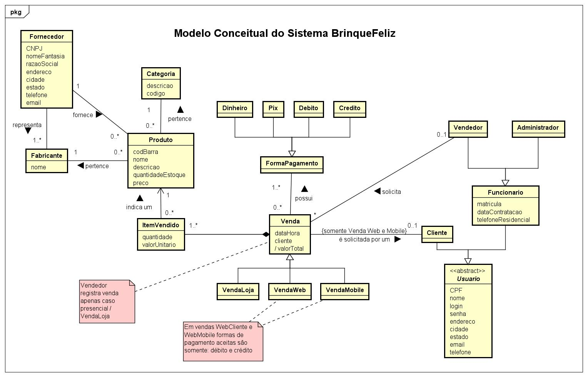
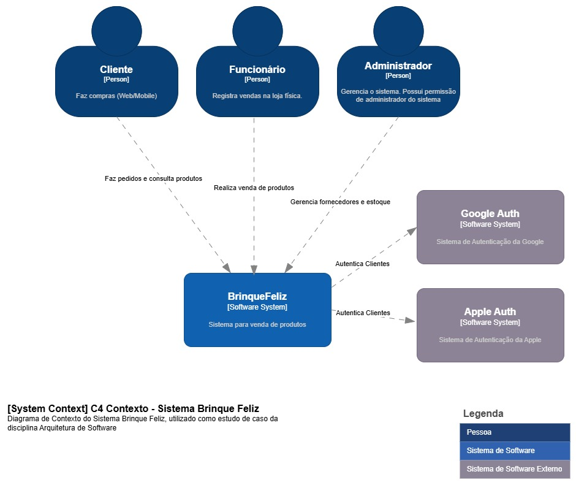
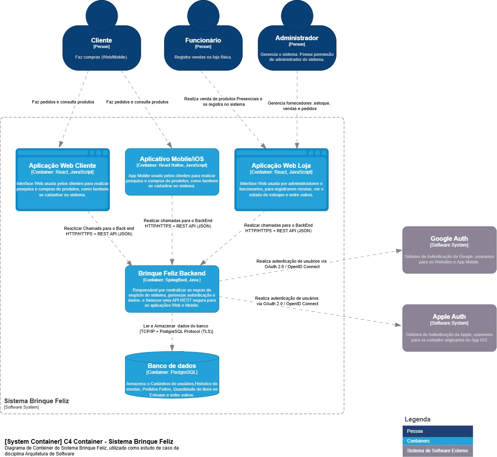

# UFMS_ArquiteturaDeSoftware_BrinqueFeliz
Diagramas e artefatos de modelagem do sistema "Brinque Feliz" realizados ao longo da disciplina Arquitetura de Software.

* **Faculdade:** UFMS
* **Curso:** Engenharia de Software
* **Ferramentas:**
  - Astah
  - draw.io
  - Structurizr
 
### Descrição simplificada:
O sistema BrinqueFeliz trata do gerenciamento para uma loja de brinquedos. Tem como objetivos o 
gerenciamento de estoque de produtos (brinquedos) e o registro de venda dos produtos.  
O cliente pode realizar a compra de um produto por três formas distintas: 
i) via website da 
BrinqueFeliz; 
ii) via aplicativo mobile BrinqueFeliz; ou  
iii) pessoalmente na loja BrinqueFeliz.   
Para realizar uma compra via website ou aplicativo, o cliente deve possuir cadastro e estar logado. 
Nesse caso não há intermediação de funcionários da loja.  
Para realizar uma compra pessoalmente na loja, o cliente deve solicitar ajuda a um vendedor que irá 
registrar a venda no sistema. Nesse caso, o cliente não necessita ter cadastro, pois o sistema será 
operado pelo vendedor.  
O sistema é composto por três aplicações:  
* Website Loja: aplicação web que será acessada pelos funcionários da loja (administrado e 
funcionário) para realização de suas tarefas.  
* Website Cliente: aplicação web, que será acessada pelo cliente para realização de compras; e 
* App Mobile: aplicativo para Android e iOS, que será acessada pelo cliente para realização de 
compras. 

 
### Modelagem:
 * #### **Diagrama Conceitual**
 <!--* ;-->

  

### **C4**
* #### **Diagrama de Contexto**

  

  <!-- [Documento Script SQL](./universidade.sql) -->
  
* #### **Diagrama Container**

  

* #### **Diagrama Implantação**

  

  
⚠ **Atenção**: Material com fins de aprendizado, e assim sendo, pode conter **erros** e **insconsistências**.

* ### **Links e material de apoio** 📖
 - [Modelo Conceitual](https://fernandommota.github.io/academy/disciplines/2015/analise_projeto_software/files/08_modelo_conceitual.pdf)
 - [Diagrama de Classes](https://deinf.ufma.br/~geraldo/dob/7.Classes.pdf)
 - [C4 Model](https://medium.com/cajudevs/entendendo-o-c4-model-uma-abordagem-para-arquitetura-de-software-3ed0f007ae66)
 
    

